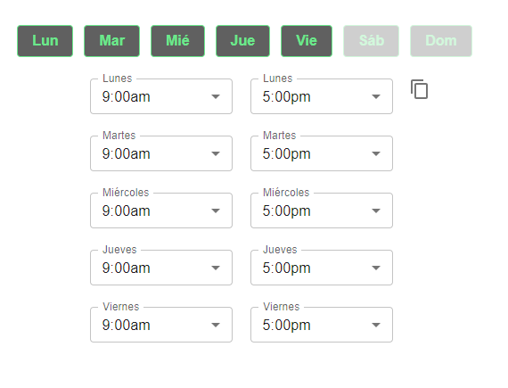

# Recipes

### Example from the homepage, but in French:

```jsx
import React from "react";
import { ContentCopyOutlined } from "@mui/icons-material";
import { OpeningHoursUnstyled } from "react-opening-hours";
import { IconButton, Tooltip, Typography } from "@mui/material";
import Select from "react-select";

const customSelectStyles = {
  control: (provided, state) => ({
    ...provided,
    marginRight: 8,
    width: "120px",
    fontFamily: "tahoma",
    border: "1px solid " + (state.isFocused ? "#909090" : "#6be88c"),
    boxShadow: state.isFocused ? "#000000" : null,
    "&:hover": {
      border: "1px solid #6be88c",
    },
  }),
  option: (provided, state) => ({
    ...provided,
    fontFamily: "tahoma",
    background: state.isFocused
      ? "#909090"
      : state.isSelected
      ? "#606060"
      : null,
    color: state.isFocused || state.isSelected ? "white" : "black",
  }),
};

const AntDesignButton = ({ id, text, onClick, active }) => {
  const buttonStyleActive = {
    display: "inline-block",
    padding: "8px 16px",
    fontSize: "16px",
    fontWeight: "bold",
    textAlign: "center",
    textDecoration: "none",
    border: "1px solid #6be88c",
    borderRadius: "4px",
    cursor: "pointer",
    color: "#6be88c",
    backgroundColor: "#606060",
    marginRight: 12,
    transition: "background-color 0.3s, color 0.3s, border 0.3s",
  };

  const buttonStyleInactive = { ...buttonStyleActive, opacity: 0.3 };

  return (
    <button
      key={id}
      style={active ? buttonStyleActive : buttonStyleInactive}
      onClick={onClick}
    >
      {text}
    </button>
  );
};

export const MyForm = () => (
  <OpeningHoursUnstyled
    getValues={(values) => console.log(values)}
    defaultValues={[
      { id: "dimanche_ouvert", time: "closed", label: "Dimanche" },
      { id: "dimanche_fermé", time: "closed", label: "Dimanche" },
      { id: "lundi_ouvert", time: "09:00:00", label: "Lundi" },
      { id: "lundi_fermé", time: "17:00:00", label: "Lundi" },
      { id: "mardi_ouvert", time: "09:00:00", label: "Mardi" },
      { id: "mardi_fermé", time: "17:00:00", label: "Mardi" },
      { id: "mercredi_ouvert", time: "09:00:00", label: "Mercredi" },
      { id: "mercredi_fermé", time: "17:00:00", label: "Mercredi" },
      { id: "jeudi_ouvert", time: "09:00:00", label: "Jeudi" },
      { id: "jeudi_fermé", time: "17:00:00", label: "Jeudi" },
      { id: "vendredi_ouvert", time: "09:00:00", label: "Vendredi" },
      { id: "vendredi_fermé", time: "17:00:00", label: "Vendredi" },
      { id: "samedi_ouvert", time: "closed", label: "Samedi" },
      { id: "samedi_fermé", time: "closed", label: "Samedi" },
    ]}
    ampm
    showCopyToAll
    dayButtonContainerStyles={{ marginBottom: 12 }}
    renderDayButton={(props) => <AntDesignButton key={props.id} {...props} />}
    getDayButtonLabelText={(label) => label.slice(0, 3)}
    renderCopyButton={({ onClick }) => (
      <Tooltip title="Copy To All">
        <IconButton
          onClick={onClick}
          sx={{ position: "absolute", right: 30, top: 0 }}
        >
          <ContentCopyOutlined />
        </IconButton>
      </Tooltip>
    )}
    selectContainerStyles={{ width: "140px" }}
    labelContainerStyles={{ width: "90px" }}
    renderSelect={(props) => <Select styles={customSelectStyles} {...props} />}
    renderLabel={({ id, label, ...other }) => (
      <Typography
        key={id}
        variant="body1"
        {...other}
        sx={{ lineHeight: 3, fontFamily: "tahoma" }}
      >
        {label}
      </Typography>
    )}
  />
);

export default MyForm;
```

### Example using MUI Select, first day of the week as Monday, 24-hour format, in Spanish



```jsx
<OpeningHoursUnstyled
  getValues={(values) => console.log(values)}
  defaultValues={[
    { id: "lun_open", time: "09:00:00", label: "Lunes" },
    { id: "lun_close", time: "17:00:00", label: "Lunes" },
    { id: "mar_open", time: "09:00:00", label: "Martes" },
    { id: "mar_close", time: "17:00:00", label: "Martes" },
    { id: "mie_open", time: "09:00:00", label: "Miércoles" },
    { id: "mie_close", time: "17:00:00", label: "Miércoles" },
    { id: "jue_open", time: "09:00:00", label: "Jueves" },
    { id: "jue_close", time: "17:00:00", label: "Jueves" },
    { id: "vie_open", time: "09:00:00", label: "Viernes" },
    { id: "vie_close", time: "17:00:00", label: "Viernes" },
    { id: "sab_open", time: "closed", label: "Sábado" },
    { id: "sab_close", time: "closed", label: "Sábado" },
    { id: "dom_open", time: "closed", label: "Domingo" },
    { id: "dom_close", time: "closed", label: "Domingo" },
  ]}
  showCopyToAll
  dayButtonContainerStyles={{ marginBottom: 12 }}
  renderDayButton={(props) => <AntDesignButton key={props.id} {...props} />}
  getDayButtonLabelText={(label) => label.slice(0, 3)}
  renderCopyButton={({ onClick }) => (
    <Tooltip title="Copy To All">
      <IconButton
        onClick={onClick}
        sx={{ position: "absolute", right: 30, top: 0 }}
      >
        <ContentCopyOutlined />
      </IconButton>
    </Tooltip>
  )}
  selectContainerStyles={{ width: "180px" }}
  labelContainerStyles={{ display: "none" }}
  renderSelect={({ id, day, options, value, onChange }) => {
    return (
      <FormControl sx={{ width: "160px", my: 1 }}>
        <InputLabel>{day.label}</InputLabel>
        <Select
          size="small"
          key={id}
          id={id}
          value={value.value}
          label={day.label}
          onChange={onChange}
        >
          {options.map((o) => (
            <MenuItem key={o.value} value={o.value}>
              {o.label}
            </MenuItem>
          ))}
        </Select>
      </FormControl>
    );
  }}
/>
```
